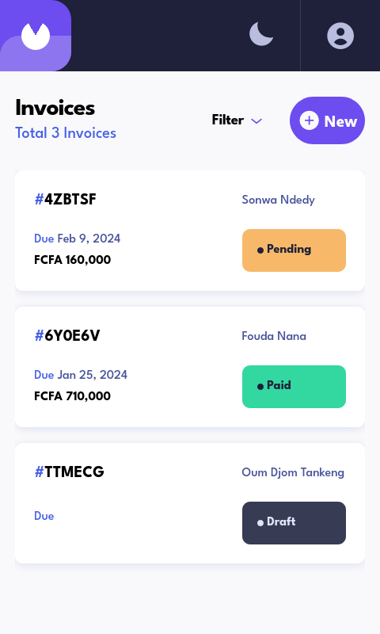
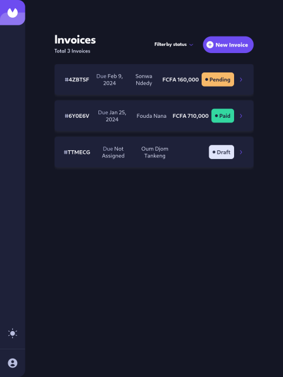

# Frontend Mentor - Invoice app solution

This is a solution to the [Invoice app challenge on Frontend Mentor](https://www.frontendmentor.io/challenges/multistep-form-YVAnSdqQBJ) Frontend Mentor challenges help you improve your coding skills by building realistic projects.

## Table of contents

- [Overview](#overview)
  - [The challenge](#the-challenge)
  - [Screenshot](#screenshot)
  - [Links](#links)
- [My process](#my-process)
  - [Built with](#built-with)
  - [What I learned](#what-i-learned)
  - [Continued development](#continued-development)
  - [Useful resources](#useful-resources)
- [Author](#author)


## Overview
This invoicing web application will users to create invoice and print it locally
additionally they'll be able to manage their invoices

### The challenge

Users should be able to:

- Create, read, update, and delete invoices
- Receive form validations when trying to create/edit an invoice
- Save draft invoices, and mark pending invoices as paid
- Filter invoices by status (draft/pending/paid)
- Toggle light and dark mode
- View the optimal layout for the app depending on their device's screen size
- See hover states for all interactive elements on the page - A step is submitted, but no selection has been made
- Keep track of any changes, even after refreshing the browser

### Screenshot




### Links

- Solution URL: [The github Repository](https://github.com/jay-ike/invoice-app)
- Live Site URL: [github page](https://jay-ike-invoice.vercel.app)

## My process

### Built with

- Semantic HTML5 markup
- CSS Print
- Flexbox
- CSS Grid
- Mobile-first workflow
- DOM Scripting with javascript

### What I learned

In most cases it is important to use interactive elements rather than using non-interactive elements and adding the tabindex attribute

```html
<!-- Don't do this -->
<div tabindex="0"></div>

<!-- Instead do this -->
<button></button>
```

In css we can style a web page for printing purposes which can enable us to directly print our invoice in the browser

```css
//to define the page size when printed
@page {
    size: A4;
}
```

In javascript we can communicate we a script running in a different thread thanks to MessageChannel
```js
    const worker = new Worker();
    const channel = new MessageChannel();
    //initialize the communication (The worker will be able to send message with the port2)
    worker.postMessage(
            "message port sent",
            "*",
            [channel.port2]
    );

    //listen to messages sent by the worker
    channel.port1.onmessage = function (message) {
        console.log(message);
    }

    //send data to the worker
    channel.port1.postMessage(data);
}

```

### Continued development

We can still improve the project with the following features:
- setup user preferences(currency, print layout, etc)
- add service worker to improve performance
- setup the server to be able to use the app anywhere

### Useful resources

- [Mozilla developer network](https://developer.mozilla.com) - This is where I usually go when looking for documentation even though for more in-depth knowledge I recommend reading the specifications


## Author

- Website - [Ndimah Tchougoua](https://www.github.com/jay-ike)
- Frontend Mentor - [@jay-ike](https://www.frontendmentor.io/profile/jay-ike)

